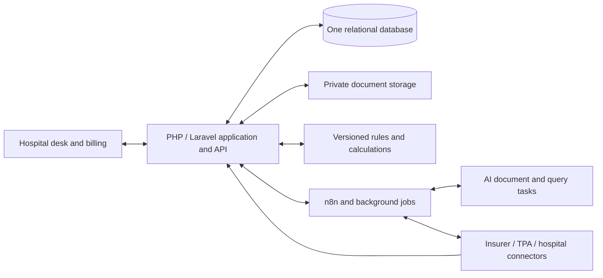

# Smiley: hospital insurance desk build map

Planning draft, 29 September 2026. Based on all five newly supplied files. No application or database changes have been made.

We are building a hospital-facing insurance claims workspace. The insurance desk sees one case, its documents, insurer/TPA correspondence, money, owner, and next action. Agents prepare and check work, coordinate follow-up, and surface exceptions. Hospital staff remain responsible for clinical facts and confirmed patient charges; the insurer/TPA supplies the actual approval or rejection.

## The patient journey

Patient registration -> insurance category, insurer, TPA and policy -> eligibility -> pre-authorization -> treatment and any increased-approval requests -> final bill and discharge documents -> final submission -> insurer query / approval / rejection -> patient amount confirmation -> later insurer settlement and reconciliation.

Queries can return a case to document collection or resubmission. Emergency and reimbursement cases can follow different routes. This is a case timeline with repeated actions, not a rigid one-pass chain.

The 1-2 hour ambition should initially mean **a defined cashless discharge turnaround**, measured from an agreed event such as final-bill readiness. Record preparation time, submission acknowledgement, insurer waiting time, and desk resolution separately. The stated 24-hour baseline is a hypothesis to measure. Approval, discharge clearance, and money arriving in the bank are different milestones; Smiley cannot guarantee an insurer response or settlement within two hours.

For context, a [March 2026 Ministry of Finance release](https://www.pib.gov.in/newsite/erelcontent.aspx?lang=2&reg=48&relid=286915) confirms prescribed cashless pre-auth and final-authorization timelines of one and three hours respectively. Those requirements are not evidence of actual hospital turnaround, and do not mean insurer money reaches the hospital within that window.

## How the system fits together

**Working stack:** retain the supplied PHP/Laravel direction for the application, Bootstrap for the desk screens, n8n for external workflows, and an AI/OCR service for document work. Use **one database**. The source stack specifies MySQL and also supplies a PostgreSQL conversion; there is no demonstrated product need in these files to switch databases. Decide before implementation after the access/isolation design is agreed. Hosting and AI/OCR vendors remain open choices.

The application owns access checks, case states, financial calculations, and the permanent record. n8n schedules and connects work through controlled APIs. AI returns structured proposals linked to source documents; it does not independently decide eligibility, invent missing clinical facts, or calculate final patient debt.

## Build order

| Step | What we build | A complete result looks like |
|---|---|---|
| 1. Define the first case | Walk through one hospital's cashless discharge; identify forms, approved rules, existing HIS exports, payer access and timer start/end. | Five fictional cases cover approval, query, missing evidence, deduction dispute, and partial payment. |
| 2. Establish the foundation | Select one database, repair the supplied draft, use repeatable migrations, add hospital/branch boundaries, staff permissions, private storage and audit history. | A staff member can sign in and access only authorized hospital cases and files. |
| 3. Build the desk workspace | Patient/policy intake, claim queue, document checklist, owner, due time and full timeline. Import existing hospital data where possible. | The desk knows what is missing and who must act, including manual insurer steps. |
| 4. Add document agents | Read policy cards, policies, bills, discharge summaries and insurer letters; extract fields and flag conflicts. | Every important value has source evidence; unreadable or uncertain fields reach staff review. |
| 5. Add rules and bill assessment | Apply hospital-approved, versioned coverage/package/room-limit/co-pay/deductible/non-payable rules to verified facts. | Reproducible provisional estimates show their reasons; unsupported rules stop for review. |
| 6. Add earlier-stage automation | Eligibility requests, pre-auth packs, response tracking, treatment updates and requests for increased approval. | Requests and actual payer responses are recorded separately, with follow-up owners. |
| 7. Connect submission and queries | Assemble final claim packs; start with one permitted insurer/TPA channel; capture acknowledgements and draft evidence-backed query responses. | A case can be submitted, queried and resubmitted without duplicates; staff can complete a blocked portal step. |
| 8. Resolve discharge decisions | Import the actual authorization, compare it with the assessment, investigate deductions and obtain billing confirmation. | Estimate, pre-auth, final approval, concessions, disputes, deposits and patient collectible remain separate facts. |
| 9. Reconcile money and report | Match insurer remittances and patient receipts; support partial payments, reversals and unpaid balances; show aging and turnaround. | Finance can explain each outstanding amount; approved does not automatically mean paid. |
| 10. Validate and release | Check calculations, access isolation, duplicate events, failed jobs, restore procedures and staff workflows; benchmark permitted cases before live rollout. | Synthetic technical readiness, permitted historical validation and identifiable-data production each have their own completion evidence. |

**Recommended first release:** steps 1-5 plus discharge decision handling and basic settlement tracking; keep eligibility/pre-auth as a visible timeline and submission as a staff-assisted handoff. Then deepen steps 6-7 once payer access is confirmed. The full end state covers the whole JPEG workflow, including reimbursement and government/corporate variants in later releases. This expands the earlier workspace roadmap's submission boundary; it does not silently make every integration part of v1.

Start with one application containing focused modules and task-specific agent functions. A microservice for every box or a freely autonomous agent for every stage would add operational work before proving hospital value.

## Suggested improvements and their reasons

| Proposal | Concrete reason | Effect on the supplied stack |
|---|---|---|
| Keep the provided stack initially | No requirement in these files shows that replacing PHP, Bootstrap or n8n would improve the hospital workflow. | No replacement proposed. |
| Prefer Laravel over custom PHP if the team has no established framework | Staff access, validation, migrations and queued work need consistent shared implementation. A framework avoids rebuilding those basics; Laravel documents [authorization](https://laravel.com/docs/authorization) and [background queues](https://laravel.com/framework/docs/queues). | Selects the Laravel option already shown in the image; team capability still matters. |
| Add private document storage | The SQL stores file paths and hashes; that does not implement secure file access or preserve document versions. | Adds a storage responsibility, not a new frontend/backend stack. |
| Make background work durable and duplicate-safe | Logging a workflow run does not prevent a retry from submitting the same claim twice or losing work after a crash. | Keep n8n, with controlled application APIs, acknowledgements and recoverable jobs. |
| Separate AI interpretation from financial rules | A repeated assessment must produce the same supported amounts and show which contract/policy version caused them. | AI extracts and explains; application rules calculate and record evidence. |
| Keep one application initially | Splitting every lifecycle step into an independently deployed service increases integration and operating work. | Organize focused modules inside the application. |

PostgreSQL becomes a reasoned option if we choose [database row-level access policies](https://www.postgresql.org/docs/current/ddl-rowsecurity.html) or another specific requirement that benefits from its features. Its presence as a converted SQL file alone is not a reason to migrate from MySQL. Laravel also supports [file storage abstractions](https://laravel.com/framework/docs/filesystem), so private document handling need not force a different backend. These are planning proposals; no stack migration has been made.

## What must be resolved before coding

The image and SQL are different revisions: both SQL files declare 42 tables and four views, while the image says 36 tables and advertises routines/triggers absent from the SQL. The PostgreSQL file contains incomplete uniqueness constraints; the MySQL dashboard has an undefined table alias. Neither is an import-ready production schema.

Next decisions: the pilot hospital and cashless workflow, one database choice, approved rule ownership, actual payer connection access, and exactly which turnaround the 1-2 hour target measures. These do not prevent this build map; they shape the implementation specification.

All five files were read as reference material. Installation instructions inside them were not executed. Detailed source findings are in `Smiley-source-review-2026-09-29.md`.
